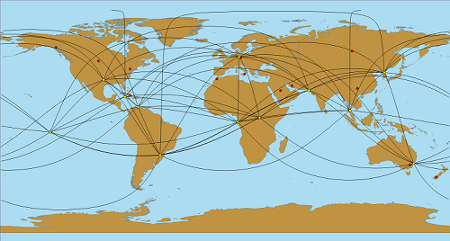

Beeline
================
A simple QGIS plugin that creates lines along great circles to connect a set of input points. 
Example:

Project home and bug tracker: https://github.com/Ah4b/Beeline

Important notes on input data:

* accepts only WGS 84
* ignores invalid geometries
* works well for up to a few hundred input points (save your project and edits!)

Third-Party Components
-------------
GeographicLib by Charles Karney: https://geographiclib.sourceforge.io/

License
-------------
This program is free software; you can redistribute it and/or modify
it under the terms of the GNU General Public License as published by
the Free Software Foundation; either version 2 of the License, or
(at your option) any later version.